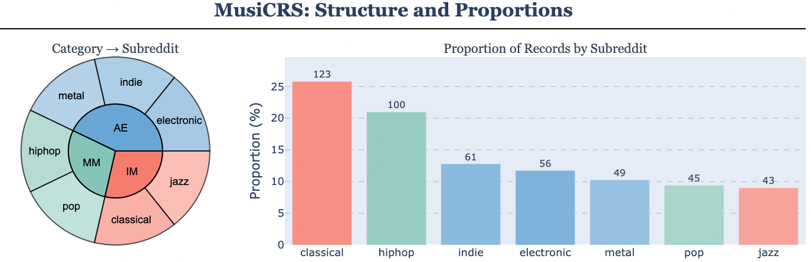

# MusiCRS: Benchmarking Audio-Centric Conversational Recommendation

<div align="center">

[](https://arxiv.org/abs/2509.19469)
[](https://huggingface.co/datasets/rohan2810/MusiCRS)
[](https://www.python.org/downloads/release/python-3100/)
[](https://creativecommons.org/licenses/by/4.0/)

**[Rohan Surana](https://www.linkedin.com/in/~rsurana/)¹** · **[Amit Namburi](https://namburiamit.com/)¹** · **[Gagan Mundada](https://www.linkedin.com/in/gaganmundada/)¹** · **[Abhay Lal](https://abhay-lal.me/)¹** · **[Zachary Novack](https://zacharynovack.github.io/)** · **[Julian McAuley](https://cseweb.ucsd.edu/~jmcauley/)** · **[Junda Wu](https://scholar.google.com/citations?user=_iKeQFwAAAAJ&hl=en&oi=ao)**

*University of California, San Diego*

¹Equal contribution

[Paper](https://arxiv.org/abs/2509.19469) | [Dataset](https://huggingface.co/datasets/rohan2810/MusiCRS) | [Demo](#usage)

</div>

---

## 📖 Overview

**MusiCRS** is the first benchmark for **audio-centric conversational recommendation** that explicitly links authentic user conversations with corresponding audio tracks. Built from large-scale Reddit discussions where users naturally exchange music suggestions, MusiCRS enables rigorous evaluation of cross-modal understanding in conversational recommendation systems.

### Key Features

- **🎵 Audio Grounding**: 477 high-quality Reddit conversations spanning 7 genres (classical, hip-hop, electronic, metal, pop, indie, jazz) with 3,589 unique musical entities, all linked to audio via validated YouTube URLs
- **💬 Authentic Conversations**: Real-world music discovery scenarios captured from Reddit discussions with rich contextual information
- **🔄 Multimodal Evaluation**: Three input configurations (audio-only, query-only, audio+query) for systematic comparison across modalities
- **📊 Comprehensive Baselines**: Evaluation of audio-LLMs (Qwen2-Audio, SALMONN), retrieval models (CLAP, CoLLAP), and traditional approaches

<div align="center">


*Representative examples showing Reddit conversations, queries, and candidates across genres ([Full PDF](img/fig2.pdf))*
</div>

<div align="center">


*Performance across genres and modalities*
</div>

---

## 🗂️ Repository Structure

```
reddit-music/
├── data_prep/              # Data preparation and preprocessing scripts
│   ├── extract_month_subreddit.py
│   ├── filter_threads.py
│   ├── download_audio_dataset.py
│   ├── convert_to_wav.py
│   └── README.md          # Detailed data pipeline documentation
├── pipeline/              # Candidate pool selection and enhancement
│   └── candidate_pool_selection_enhanced.py
├── generative/            # Generative model implementations
│   ├── qwen.py           # Qwen2-Audio
│   ├── qwen-omni.py      # Qwen2.5-Omni
│   ├── phi.py            # Phi-4-Mini
│   ├── SALMONN/          # SALMONN model
│   ├── SALMONN-7B/       # SALMONN-7B model
│   ├── FUTGA/            # FUTGA model
│   └── audio-flamingo-3/ # Audio Flamingo 3
├── retrieval/             # Retrieval-based baselines
│   ├── clap.py           # CLAP model
│   └── collap.py         # CoLLAP model
├── traditional/           # Traditional baselines
│   ├── popularity.py     # Popularity-based
│   └── naive_nbcrs.py    # Naive NBCRS
├── requirements_qwen_audio.txt
├── requirements_qwen_omni.txt
└── img/                   # Paper figures and visualizations
```

---

## 🚀 Installation

### Prerequisites

- Python 3.10+
- CUDA-compatible GPU (recommended for model inference)
- `ffmpeg` (for audio processing)
- `zstd` (for data decompression)

### Setup

1. **Clone the repository**:
```bash
git clone https://github.com/rohan2810/musiCRS.git
cd musiCRS
```

2. **Create conda environment**:
```bash
conda create -n musicrs python=3.10 -y
conda activate musicrs
```

3. **Install dependencies** (choose based on your needs):

```bash
# For Qwen2-Audio models
pip install -r requirements_qwen_audio.txt

# For Qwen2.5-Omni
pip install -r requirements_qwen_omni.txt

# For SALMONN and SALMONN-7B
pip install -r generative/SALMONN/requirements.txt
pip install -r generative/SALMONN-7B/requirements.txt

# Optional utilities (retrieval baselines, data processing)
pip install sentence-transformers faiss-cpu google-api-python-client streamlit duckdb zstandard
```

4. **Set environment variables** (optional):
```bash
export WANDB_API_KEY="your_wandb_key"      # For experiment tracking
export YOUTUBE_API_KEY="your_youtube_key"  # For dataset enhancement
```

---

## 📊 Dataset

### Download

The MusiCRS dataset is available on Hugging Face:

```python
from datasets import load_dataset

dataset = load_dataset("rohan2810/MusiCRS")
```

Or download directly: [🤗 MusiCRS Dataset](https://huggingface.co/datasets/rohan2810/MusiCRS)

### Dataset Statistics

| Metric | Value |
|--------|-------|
| Total Conversations | 477 |
| Unique Musical Entities | 3,589 |
| Genres | 7 (Classical, Hip-Hop, Electronic, Metal, Pop, Indie, Jazz) |
| Avg. Candidates per Query | 100 |
| Avg. Ground Truth Items | 10 per conversation |

### Environment Variables

Configure data paths via environment variables (defaults provided):

```bash
export AUDIO_BASE_DIR=audio/full/wav
export INPUT_JSONL=data/merged_final_cleaned_music_clean_queries_with_candidates_enhanced_v2_100_candidates.jsonl
```

---

## 🎯 Usage

All models support three evaluation modes:
- **`audio_only`**: Use only audio tracks for ranking
- **`query_only`**: Use only conversational text for ranking  
- **`audio_query`**: Combine both audio and text (multimodal)

### Retrieval-Based Models

#### CLAP (Contrastive Language-Audio Pretraining)

```bash
python retrieval/clap.py
```

**Configuration**: Edit `MODES` variable in the script or set environment variables:
- `AUDIO_BASE_DIR`: Path to audio files (default: `audio/full/wav`)
- `INPUT_JSONL`: Path to dataset JSONL file
- `CLAP_OUTPUT_DIR`: Output directory (default: `retrieval/results/CLAP_FINAL`)

**Key Parameters**:
- Model: `laion/larger_clap_music_and_speech`
- Audio budget: 300 seconds per post
- Segment size: 10 seconds
- Max files per post: 10

#### CoLLAP (Contrastive Long-form Language-Audio Pretraining)

```bash
python retrieval/collap.py
```

**Requirements**: Requires pre-trained SALMONN model for audio feature extraction.

**Configuration**:
- Set `INPUT_JSONL` and `AUDIO_DIR` in the script
- Configure SALMONN checkpoint, Whisper, and BEATs paths
- Adjust `AUDIO_BUDGET_SECS` (default: 300s) and `MAX_CLIPS` (default: 10)

---

### Generative Models (Audio-LLMs)

#### Qwen2-Audio

```bash
python generative/qwen.py
```

**Model**: `Qwen/Qwen2-Audio-7B-Instruct`

**Configuration**: Edit `modes` variable in script (line 143):
```python
modes = ["audio_only", "query_only", "audio_query"]
```

**Key Features**:
- Smart audio budget allocation across multiple clips
- Random clip sampling with duration adaptation
- Candidate shuffling to reduce position bias

#### Qwen2.5-Omni

```bash
python generative/qwen-omni.py
```

**Model**: `Qwen/Qwen2.5-Omni-7B`

**Configuration**: Edit `modes` variable in script (line 178):
```python
modes = ["audio_query", "audio_only", "query_only"]
```

**Special Features**:
- Supports multimodal input (audio + text)
- Built-in talker disabled for text-only output
- Handles empty audio gracefully

#### Phi-4-Multimodal

```bash
python generative/phi.py
```

**Model**: `microsoft/Phi-4-multimodal-instruct`

**Requirements**: Flash Attention 2 recommended

**Configuration**:
- Set `audio_base`, `input_jsonl`, `output_root` in script
- Modify `modes` list (line 181)

**Note**: Uses special audio tokens (`<|audio_1|>`, `<|audio_2|>`, etc.)

#### SALMONN

```bash
python generative/SALMONN/cli_inference.py \
  --cfg-path generative/SALMONN/configs/decode_config.yaml \
  --device cuda:0
```

**Requirements**: 
- Config file: `generative/SALMONN/configs/decode_config.yaml`
- Whisper model path
- BEATs model checkpoint

**Configuration**:
- Edit `modes` in script or config YAML
- Set model paths in config file
- Adjust `audio_budget_secs` (default: 30s for SALMONN)

**Environment Variables**:
- `SALMONN_CFG`: Path to config file
- `INPUT_JSONL`: Input data path
- `AUDIO_BASE_DIR`: Audio directory

#### SALMONN-7B

```bash
python generative/SALMONN-7B/cli_inference.py \
  --cfg-path generative/SALMONN-7B/configs/decode_config.yaml \
  --device cuda:0
```

Similar to SALMONN but with 7B parameter model for enhanced performance.

#### FUTGA

```bash
python generative/FUTGA/cli_inference.py \
  --device cuda:0 \
  --ckpt_path ./salomnn_7b.bin \
  --whisper_path generative/SALMONN/whisper-large-v2 \
  --beats_path generative/SALMONN/BEATs_iter3_plus_AS2M_finetuned_on_AS2M_cpt2.pt \
  --vicuna_path generative/SALMONN-7B/vicuna-7b-v1.5
```

**Requirements**: Pre-trained checkpoints for Whisper, BEATs, and Vicuna

**Optional Flags**:
- `--low_resource`: Enable for limited GPU memory
- `--debug`: Enable debug mode

**Configuration**: Edit `modes` variable in script (default: all three modes)

---

### Traditional Baselines

#### Popularity-Based Ranking

```bash
python traditional/popularity.py
```

Ranks candidates by subreddit-specific popularity (frequency in candidate pools).

**Configuration**:
- `INPUT_JSONL`: Input dataset
- `POPULARITY_OUTPUT`: Output path
- `MAX_PREDICTIONS`: Number of predictions (default: 100)

#### Naive NBCRS

```bash
python traditional/naive_nbcrs.py
```

Traditional neighborhood-based collaborative recommender system.

---

### Evaluation

All models automatically compute and log metrics. For standalone evaluation:

```bash
python eval_stats.py
```

**Metrics Computed**:
- Recall@K (K=5, 10, 20)
- Precision@K
- nDCG@K
- Mean Reciprocal Rank (MRR)
- Per-subreddit breakdown

---

## 🔬 Data Pipeline

For researchers interested in reproducing the dataset or creating similar benchmarks, we provide comprehensive data preparation scripts.

**See [`data_prep/README.md`](data_prep/README.md) for detailed documentation.**

**Pipeline Overview**:
1. **Extract** Reddit submissions and comments from monthly dumps
2. **Filter** threads by quality criteria (YouTube links, reply count, comment length)
3. **Download** audio via `yt-dlp`
4. **Convert** to WAV format (16kHz)
5. **Generate** queries and extract entities using LLMs
6. **Construct** candidate pools with ground truth and negative samples

---

## 📈 Results

Our comprehensive benchmark reveals critical insights about current audio-centric conversational recommendation systems:

### Key Findings

**🎯 The Multimodal Integration Challenge**: Current models often perform better with single modalities (audio-only OR query-only) than combined inputs, exposing fundamental limitations in cross-modal knowledge integration.

**📊 Model Performance Comparison** (Recall@20 / nDCG@20):

| Model | Best Config | Recall@20 | nDCG@20 |
|-------|-------------|-----------|---------|
| **CLAP** (Retrieval) | Query-only | 22.71% | 15.90% |
| **Qwen2.5-Omni** (Generative) | Combined | 21.49% | 16.21% |
| **CoLLAP** (Retrieval) | Query-only | 20.85% | 14.14% |
| **Phi-4-Multimodal** | Audio-only | 20.04% | 13.72% |
| **SALMONN-7B** | Audio-only | 19.55% | 13.66% |
| **Popularity Baseline** | N/A | 16.51% | 11.09% |

**🎵 Genre-Specific Performance** (Best Recall@20):

| Genre | Performance | Best Model |
|-------|-------------|------------|
| Jazz | 28.09% | Qwen2.5-Omni (audio-only) |
| Classical | 26.53% | Qwen2.5-Omni (combined) |
| Metal | 26.42% | CLAP (audio-only) |
| Hip-Hop | 25.12% | Phi-4 (audio-only) |
| Pop | 23.38% | Qwen2.5-Omni (query-only) |
| Electronic | 23.55% | SALMONN-7B (query-only) |
| Indie | 22.95% | Phi-4 (audio-only) |

**Key Takeaways**:
- Retrieval models (CLAP, CoLLAP) generally outperform generative audio-LLMs
- Genre significantly impacts performance (Jazz/Classical easier, Indie harder)
- Current systems rely heavily on textual signals and struggle with audio-specific features (rhythm, timbre, production style)
- Simple popularity baselines are surprisingly competitive (16.51% Recall@20)

For comprehensive analysis, evaluation protocols, and additional experiments, see our **[full paper on arXiv](https://arxiv.org/abs/2509.19469)**.

---

## 🤝 Contributing

We welcome contributions! Please feel free to:

- 🐛 Report bugs or issues
- 💡 Suggest new features or baseline models
- 🔧 Submit pull requests with improvements
- 📊 Share your experiments and results

Please open an issue or pull request on our [GitHub repository](https://github.com/rohan2810/musiCRS).

---

## 📄 Citation

If you use MusiCRS in your research, please cite our paper:

```bibtex
@article{surana2025musicrs,
  title={MusiCRS: Benchmarking Audio-Centric Conversational Recommendation},
  author={Surana, Rohan and Namburi, Amit and Mundada, Gagan and Lal, Abhay and Novack, Zachary and McAuley, Julian and Wu, Junda},
  journal={arXiv preprint arXiv:2509.19469},
  year={2025}
}
```

**Paper**: [https://arxiv.org/abs/2509.19469](https://arxiv.org/abs/2509.19469)

---

## 📜 License

This project is licensed under the [Creative Commons Attribution 4.0 International License (CC-BY-4.0)](https://creativecommons.org/licenses/by/4.0/). See individual model directories for specific model licenses.

---


<div align="center">

**MusiCRS** - Benchmarking Audio-Centric Conversational Recommendation

University of California, San Diego • 2025

</div>
